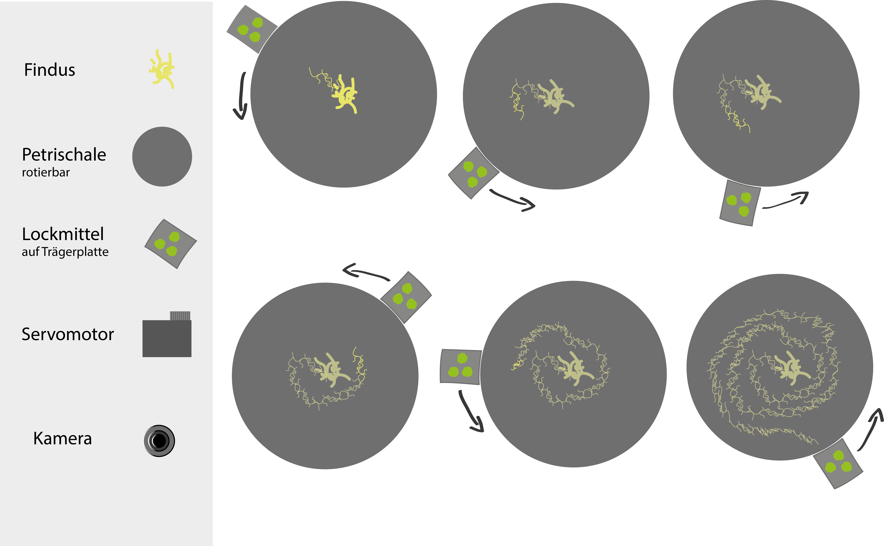
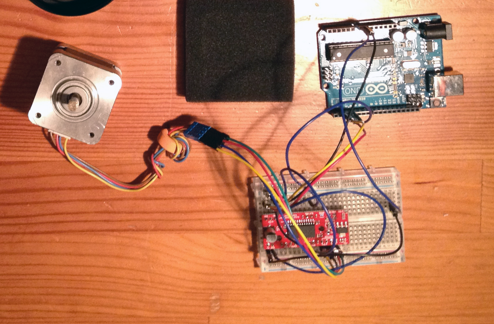
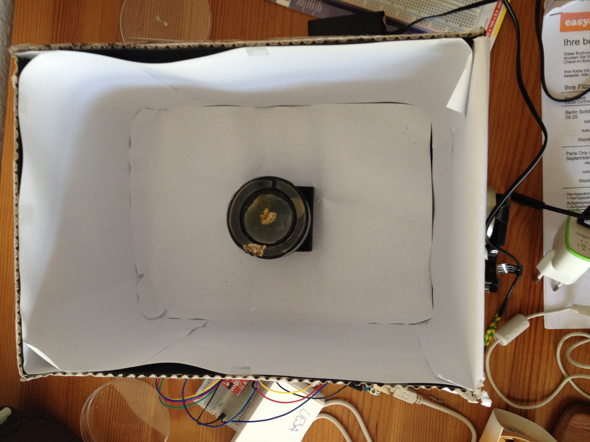
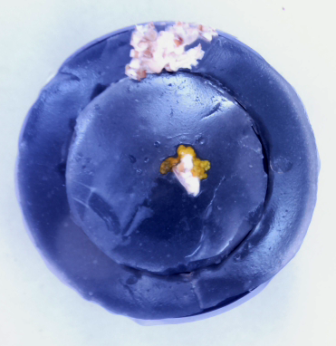
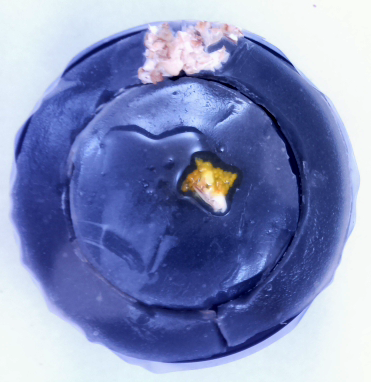
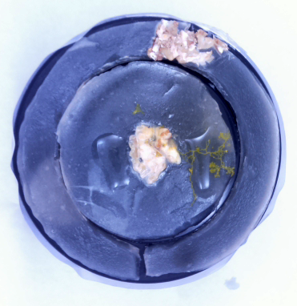

# findus

### Backround

Physarum polycephalum, also known as slime molds, belongs to the supergroup Amoebozoa, phylum Mycetozoa, and class Myxogastria. Physarum polycephalum is a slime mold that inhabits shady, cool, moist areas, such as decaying leaves and logs. It is sensitive to light; in particular, light can repel the slime mold and be a factor in triggering spore growth.
Slime mold is one example of an emergent self-organizing complex adaptive system.
It grows into an interconnected network of protoplasmic strands.
Feeding on fungi and bacteria it moves like a giant amoeba. When conditions such as light, temperature and moisture change,
the slime molds cells will join up to form a mass that that spreads to a more favorable location.

### findus the hungry slime mold

In this project we want to explore, if we can manipulate the slime molds growth.
We know, that the slime mold will spread to find new food. It never takes the same way twice, so it is somehow able
to remember where it has already been.
In our setup, we assume, that the hungry slime mold will follow the offered food.

I covered a simple pasteboard box with white paper sheets andaluminum foil to improve illumination.
To capture the development I used a [DSLR](http://gphoto.org/proj/libgphoto2/support.php) and a RaspberryPi. Many thanks to [topada](https://github.com/topada) who provides the instructions for this setup.
[DSLR Timelapse gphoto RaspberryPi](https://github.com/topada/DSLR-Timelapse-gphoto-RPI)
With a servomotor (from a printer) and an [Arduino uno](https://www.arduino.cc/en/Main/ArduinoBoardUno), I assembled the rotatable part.
During the experiment, the slime mold was placed on a little disk with substrat and got, now and then, a drop of distilled water (prevents to dry out). The disk is related to the servomotor and rotates everey 5 minutes.
The outer ring is immovable. This is where the food (mash of oat flakes) is offered (always on the same place).

Unfortunately findus died before I was able to record enough pictures.
I had a lot of problems with the storing of my photos and the connection to the raspberry pi.
Furthermore it was really tough to keep findus alive. I think he didn't like the conditions. The motor shaked and the environment was not sufficiently humid and shady.
He grow a little bit, but not in the assumed direction.
 
###License

The MIT License (MIT)

Copyright (c) 2015 Rosaplankton

Permission is hereby granted, free of charge, to any person obtaining a copy
of this software and associated documentation files (the "Software"), to deal
in the Software without restriction, including without limitation the rights
to use, copy, modify, merge, publish, distribute, sublicense, and/or sell
copies of the Software, and to permit persons to whom the Software is
furnished to do so, subject to the following conditions:

The above copyright notice and this permission notice shall be included in
all copies or substantial portions of the Software.

THE SOFTWARE IS PROVIDED "AS IS", WITHOUT WARRANTY OF ANY KIND, EXPRESS OR
IMPLIED, INCLUDING BUT NOT LIMITED TO THE WARRANTIES OF MERCHANTABILITY,
FITNESS FOR A PARTICULAR PURPOSE AND NONINFRINGEMENT. IN NO EVENT SHALL THE
AUTHORS OR COPYRIGHT HOLDERS BE LIABLE FOR ANY CLAIM, DAMAGES OR OTHER
LIABILITY, WHETHER IN AN ACTION OF CONTRACT, TORT OR OTHERWISE, ARISING FROM,
OUT OF OR IN CONNECTION WITH THE SOFTWARE OR THE USE OR OTHER DEALINGS IN
THE SOFTWARE.
